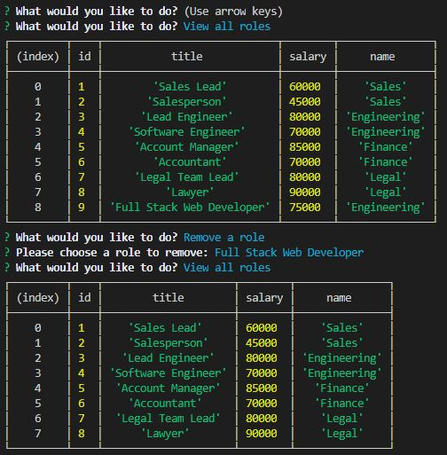
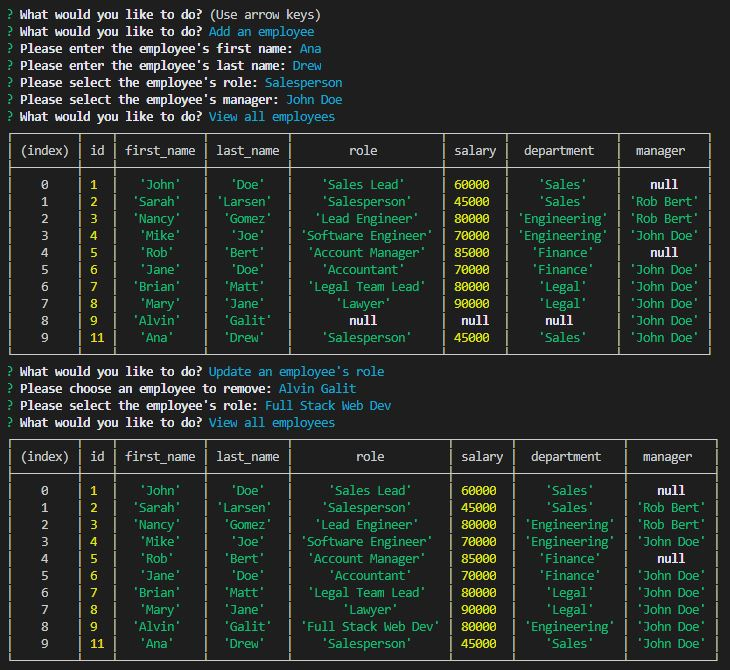

# Employee Tracker
 Command line interface for tracking employees within a company.

## Usage 
To view and manage the departments, roles, and employees in the company
To organize and plan the business

Use the MySQL NPM package to connect to your MySQL database and perform queries.

Use InquirerJs NPM package to interact with the user via the command-line.

Use console.table to print MySQL rows to the console. There is a built-in version of console.table
## Walkthrough vid
https://github.com/jojoford/SQL-employee-tracker-12/blob/main/hw-12-demo.gif

https://drive.google.com/file/d/10hisoW7acKELmQdoU06Feix10xIgJA4u/view

## Screenshots  
 
 

## Criteria fulfilled 
* Design the following database schema containing three tables:
    
* Build a command-line application that at a minimum allows the user to:
  * Add departments, roles, employees
  * View departments, roles, employees
  * Update employee roles
  * Update employee managers
  * View employees by manager
  * Delete departments, roles, and employees
  * View the total utilized budget of a department -- ie the combined salaries of all employees in that department
* Use MySQL2 database and perform queries.
* Uses the console.table package (Links to an external site.) to print MySQL rows to the console.
* Use [InquirerJs](https://www.npmjs.com/package/inquirer/v/0.2.3) NPM package to interact with the user via the command-line.
 

